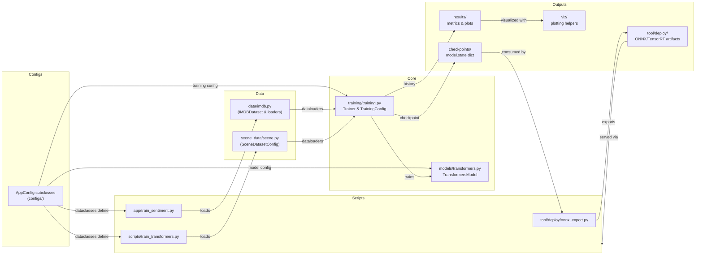
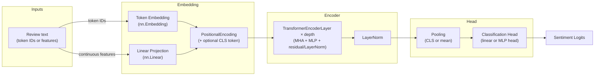

# Transformers

Lightweight transformer fine-tuning stack for IMDB sentiment classification and
TinyStories decoder language modeling, plus deployment utilities for exporting
trained models to ONNX/TensorRT/Triton.

## Project Layout

```
Transformers/
├── configs/             # Base + application configs (IMDB, TinyStories, scene demos)
├── data/                # Dataset wrappers (IMDB, TinyStories), download helpers
├── models/              # Transformer backbone components
├── scene_data/          # Scene metadata helpers (legacy research demos)
├── scripts/             # Extended training scripts (e.g., generic scene workflow)
├── training/            # Shared training loops, configs, and logging helpers
├── tool/deploy/         # Export + inference helpers (ONNX, TensorRT, Triton)
├── viz/                 # Plotting utilities for training/eval metrics
├── val/                 # Standalone validation entry-points
├── results/             # Persisted metrics and plots
├── requirements.txt     # Python dependencies
├── app/
│   ├── train_sentiment.py   # IMDB training entry-point
│   └── trainencoder.py      # TinyStories decoder LM training entry-point
└── README.md
```

## Setup

```bash
python3 -m venv .venv
source .venv/bin/activate
python -m pip install --upgrade pip
python -m pip install -r requirements.txt
```

Install extra packages if you plan to export/run ONNX or TensorRT models:

```bash
python -m pip install onnxruntime-gpu onnx onnx-tf tensorflow tensorrt pycuda
```

## Training (IMDB Sentiment)

```bash
python -m app.train_sentiment
```

`app/train_sentiment.py` loads `configs.imdb:IMDBConfig`, which captures dataset path,
tokenisation, model hyperparameters, and training knobs. `data/imdb.py` will download
the IMDB dataset (via Hugging Face `datasets`) into `data/imdb/` on first run. Cached
JSONL files remain ignored by Git.

Metrics and training curves are written to the paths defined by the active config
(`history_path`, `plot_path`).

## Training (TinyStories Language Model)

```bash
python -m app.train_encoder
```

`app/train_encoder.py` loads `configs.tinystories:TinyStoriesConfig`, streams the
TinyStories dataset via `data/tinystory.py`, and tokenizes using `GPT2TokenizerFast`.
Tokenized streams are cached under the configured `cache_dir` to speed up repeated
runs. Checkpoints, training history, and plots are written to the paths configured in
`TinyStoriesConfig` (for example `results/tiny_stories_transformer.pt`).

## Validation

Run standalone validation against the test or train split, loading a specific checkpoint:

```bash
python -m val.validate \
  --checkpoint results/model.pt \
  --config configs.imdb:IMDBConfig \
  --split test \
  --output-dir results/validation
```

The script reports evaluation metrics, saves a confusion matrix, and plots the class
distribution for the analysed split under the chosen output directory.

## Generic Scene Workflow

`scripts/train_transformers.py` demonstrates a more generic configuration-driven
workflow: pass any `AppConfig` subclass (e.g., `configs.transformers:TransformersConfig`)
and the script builds dataloaders, optimizer, and loss from the config. Scene metadata
helpers live in `scene_data/`.

## Deployment

The `tool/deploy/` directory hosts export and inference scripts:

- `onnx_export.py` — load a PyTorch checkpoint and export to ONNX (optionally TFLite).
- `infer_onnx_ort_trt.py` — quick inference harness using ONNX Runtime with TensorRT/CUDA.
- `build_trt_engine.sh` / `infer_trt_engine.py` — build and run TensorRT engines via `trtexec`.
- `triton/` — Triton Inference Server scaffolding. Drop the exported ONNX model into
  `tool/deploy/triton/model_repository/bert_sst2/1/model.onnx` and launch Triton via
  `tool/deploy/triton/run_triton_jetson.sh`.
- `tokenizer/` — store tokenizer assets alongside exported models.

## Flow Overview



## Architecture Overview

The IMDB model follows a compact Transformer encoder pipeline with optional CLS token
pooling and a lightweight classification head. Components below map directly to
`models/transformers.py` and `models/core/`.



## Visualisation

Use helpers in `viz/` (e.g., `viz.plots.plot_loss_curves`) to quickly chart loss curves,
confusion matrices, or prediction distributions during evaluation notebooks or scripts.

## Experiment Tracking (Weights & Biases)

Training scripts automatically integrate with Weights & Biases when the library is
installed and a login token is available. To enable tracking:

```bash
python -m pip install wandb  # already listed in requirements
export WANDB_API_KEY="<your-api-key>"
wandb login  # optional alternative to the env variable
```

Optional environment variables:

- `WANDB_PROJECT` (default: `transformers-imdb`)
- `WANDB_ENTITY` for team/workspace names
- `WANDB_NAME` to override the run display name
- Config fields: `IMDBConfig.wandb_api_key`, `wandb_project`, `wandb_entity`, `wandb_run_name`, `wandb_disabled`

Each run logs epoch metrics, final test results, the saved checkpoint, and history JSON as
artifacts for later analysis. Set `WANDB_DISABLED=true` to skip logging without editing the
code.

## Customisation

- Modify base defaults in `configs/base.py` and subclass them per application.
- `scene_data/` components can be adapted for other structured datasets requiring the
  TransformersModel backbone.
- Update deployment scripts with project-specific namespaces, TensorRT profiles, or Triton
  configuration as you evolve the model.***
